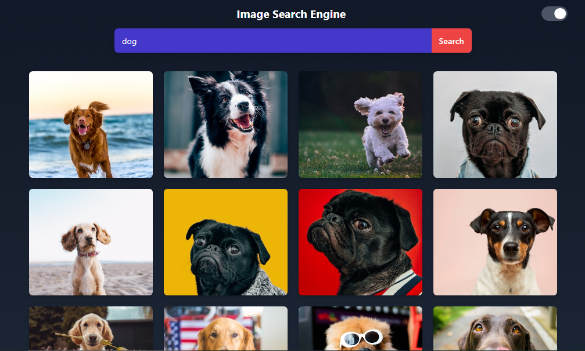

# 🖼️ Image Search App

## 📌 Project Description

This is a clean and responsive **Image Search App** developed using **React.js**, powered by the **Unsplash API** to fetch high-quality images based on user search queries.

The app features a stunning, modern interface and supports seamless toggling between **dark and light themes** to suit user preferences. Built to provide a smooth browsing experience, this app enhances your React skills in API handling, state management, and dynamic rendering.

📅 **Project Duration:** January 20, 2025 – January 25, 2025

### ✅ Key Features

- 🔎 **Search images** by keywords using the Unsplash API  
- 🎨 Display of **high-resolution images** with responsive layout  
- 🌓 Toggle between **Dark and Light Mode**  
- ⚛️ Built using **React.js** for fast and reactive UI  
- 📱 Fully responsive design – optimized for desktop and mobile  

This project helped reinforce my understanding of API integration, component-based design, and React hooks.

## 🛠️ Tech Stack

- **Frontend**: React.js, Tailwind CSS  
- **API**: Unsplash API  
- **Deployment**: GitHub Pages  

## 🚀 Live Demo

👉 [Click here to view the project](https://tahir1605.github.io/image-search/)  

---

